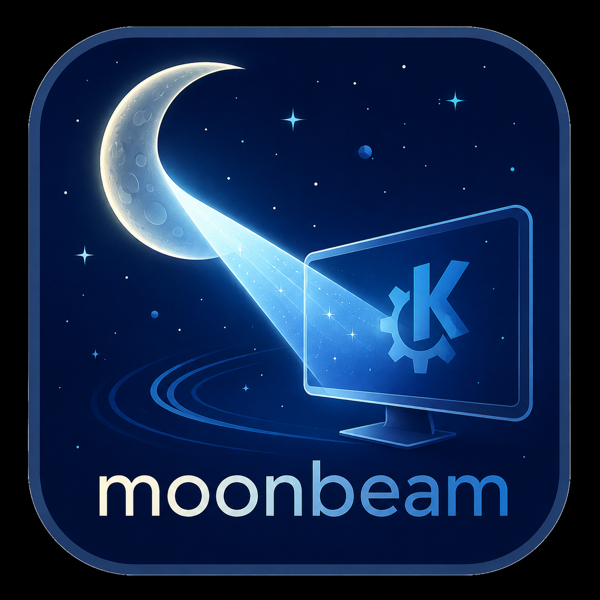
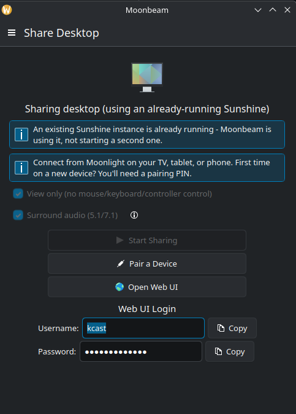

<div align="center">
  
  <h1>Moonbeam</h1>
  <p><strong>Switch presenters, not cables.</strong><br>
  Wireless screen sharing for KDE Plasma — start sharing, then enter the PIN
  Moonlight shows you and you're presenting.</p>
</div>

<p align="center">
  
</p>

Sharing a laptop screen in a meeting, classroom, or conference room
shouldn't mean searching for the right cable, the right adapter, or
whether the app you're about to show even has a "cast" button. Moonbeam
shares your KDE Plasma desktop wirelessly with any [Moonlight](https://moonlight-stream.org/)
device — phone, tablet, TV, projector, another laptop — no matter what's
on screen: a game, a terminal, a website that refuses to cooperate,
professional software with no casting support built in. If it can be
displayed, Moonbeam can share it.

That makes switching between presenters fast: whoever's turn it is opens
Moonbeam, clicks **Start Sharing**, and the next person pairs in with a
PIN — no crawling under the table for a different dongle every time.
Pairing is protected, so you connect to the intended computer, not
another device on the same Wi-Fi network.

Under the hood, Moonbeam manages [Sunshine](https://github.com/LizardByte/Sunshine),
the open-source continuation of NVIDIA GameStream — a real-time,
hardware-encoded streaming host, not a buffered casting protocol. For
normal pairing and sharing, you don't need to use Sunshine's web UI,
generate a certificate, or manage its credentials by hand — Moonbeam
handles all of that for you.

It's a companion app for [KCast](https://github.com/Agundur-KDE/KCast),
not a replacement — media casting (YouTube, Spotify, etc. to a Chromecast)
stays KCast's job, this is single-purpose by design. The plan is for KCast
to grow a "Share Desktop" launcher that starts Moonbeam, not for the two
to duplicate each other's cast flow.

## How it works

1. Open Moonbeam and click **Start Sharing**.
2. Open [Moonlight](https://moonlight-stream.org/) on the receiving
   device — [Android](https://play.google.com/store/apps/details?id=com.limelight&pli=1),
   iOS, Windows, macOS, Linux, or a smart TV all work.
3. First time on that device: Moonlight displays a PIN. Enter that PIN in
   Moonbeam, on the computer you're sharing from.
4. Present. Click **Stop Sharing** when you're done, or just hand off to
   the next presenter.

## Features

- **Present without cables.** Share your screen over the local network —
  no HDMI cable, no USB-C dongle hunt.
- **Switch presenters quickly.** The next person pairs in with a PIN
  instead of unplugging and reconnecting the room's display setup.
- **Works with anything on your screen.** The app, website, game, or
  presentation doesn't need its own casting feature.
- **Talks only to the intended Sunshine instance.** Before sending web UI
  credentials, Moonbeam verifies the certificate presented by the local
  Sunshine service against the certificate configured on this computer.
- **Secure sign-in handled for you.** Moonbeam creates and stores the
  connection credentials automatically — nothing to type into a password
  field.
- **View only**, for when you want to present without handing over
  mouse/keyboard/controller control of your computer.
- **Surround audio (5.1/7.1)** for setups with a proper receiver, not
  just stereo. See the in-app "?" button for the one-time setup this needs.
- **Translated**: English (default), German, French, Spanish, Russian.

### Note: View only / Surround audio only take effect on restart

Both switches are only clickable while not currently sharing, and
changing one while already sharing has no effect until the next restart.
Watch out for one thing in particular: the same button reads "Stop
Sharing" while sharing and "Start Sharing" once stopped, so it's easy to
reflexively click that spot twice (stop, then immediately start again)
before the switches become interactable. The sequence that actually
works:

1. Click **Stop Sharing** and wait for the status to read "Not sharing."
2. Toggle **View only** / **Surround audio** now, while stopped.
3. Click **Start Sharing** again to apply.

## Requirements

- KDE Plasma (Linux) as the sending computer.
- [Sunshine](https://github.com/LizardByte/Sunshine) installed — Moonbeam
  manages it, but doesn't install it for you.
- [Moonlight](https://moonlight-stream.org/) on whatever device you're
  sharing *to*.

## Security

- Before trusting anything as "your" Sunshine, Moonbeam checks its exact
  certificate against a pinned fingerprint — not just a name, which any
  local process could fake.
- Credentials are generated once and stored in KWallet, not typed in or
  left lying around in a config file.
- Moonbeam never starts a second Sunshine instance against one that's
  already running.

This isn't a formal security guarantee for every scenario — see
[Technical details](#technical-details) for the implementation.

## License

GPL v3, see [`LICENSE`](LICENSE) *(or the license header in individual
source files)*.

---

## Technical details

For contributors, or anyone who wants to know exactly how this works.

### What is Sunshine/Moonlight?

Two separate pieces, from the same open-source project family:

- **[Sunshine](https://github.com/LizardByte/Sunshine)** runs on the machine
  you want to share *from* - the "host". It captures your screen and audio
  and streams them out. Moonbeam manages Sunshine for you on this side:
  detects whether it's installed and running, starts/stops it safely, and
  never touches Sunshine's own web UI credentials by hand.
- **[Moonlight](https://moonlight-stream.org/)** is the client that
  connects *to* Sunshine and displays the stream. It runs on almost
  anything: [Android](https://play.google.com/store/apps/details?id=com.limelight&pli=1),
  iOS, Windows, macOS, Linux, smart TVs, and some Android-based projectors
  (including this project's own test setup, a JMGO smart beamer).

Moonbeam itself only ever runs on the **host** side - install Moonlight
separately on whatever device you want to view/control the stream from.

### Implementation notes on the Features above

- **Safe process management.** Detects whether Sunshine is installed,
  already running, or stopped, and never starts a second instance against
  an already-open web UI port - refreshes every 5s so the UI notices when
  an externally-started instance disappears on its own.
- **Certificate pinning, not a CN check.** Before trusting a port as
  actually being Sunshine (and, critically, before ever sending it
  credentials), Moonbeam pins the exact SHA-256 fingerprint of the
  certificate Sunshine is configured to serve - not just a Common Name
  string, which any local process could put in a self-signed certificate
  of its own.
- **Zero-touch credentials.** Web UI credentials are generated and stored
  in KWallet on first use, or asked for once if Sunshine already had a
  password Moonbeam didn't set - never a form field to fill in every time.
  An on-page "Web UI Login" display (masked, with copy buttons) covers the
  one case you do need them: the browser's own Basic-Auth prompt.
- **Real pairing**, via Sunshine's actual `POST /api/pin` API - Moonlight
  displays the PIN on the receiving device, you enter it in Moonbeam on
  the host, done.
- **View only.** A paired Moonlight client gets full mouse/keyboard/
  controller control of the host by default (Sunshine emulates real input
  devices) - not just a screen view. One switch turns that off for
  presenting/screen-sharing use cases.
- **Surround audio (5.1/7.1).** Points Sunshine at a multichannel audio
  sink instead of the default stereo monitor - see the in-app "?" button
  for the one-time PipeWire setup this needs. Transports discrete
  multichannel PCM (Opus), not a Dolby Atmos object-audio bitstream - your
  receiver gets real 5.1/7.1 channels, not Atmos metadata.
- **Open Web UI**, a direct link to Sunshine's own settings (apps, display/
  output choice, video/audio options) that Moonbeam deliberately doesn't
  duplicate.

### Build

Requires Qt6, Extra CMake Modules (ECM), and KF6 (CoreAddons, I18n, Kirigami,
Config, Notifications, Wallet).

```sh
cmake -B build -S .
cmake --build build
```

### Tests

`SunshineController` and `SunshineCredentials` reach the real Sunshine
process, sockets, KWallet, and filesystem only through injected interfaces
(`ISunshineProcess`, `ISunshineNetworkProbe`, `ISunshineWallet`,
`ISunshineCredentialsProcess`) - their public, QML-visible constructors wire
up the real ones; a second constructor on each takes fakes instead, so
`sunshinecontrollertest`/`sunshinecredentialstest` can exercise cert
imitation, wrong ports, invalid config, parallel-process lock contention,
wallet failures, process crashes/hangs, and tampered pairing responses
without touching a real process, socket, wallet daemon, or file.

```sh
ctest --test-dir build --output-on-failure
```
